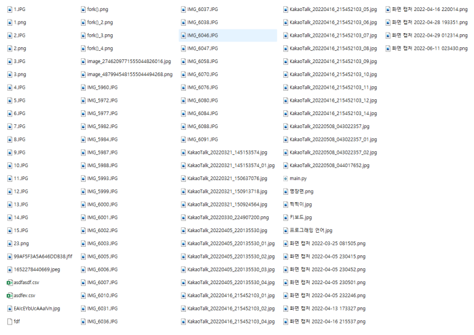
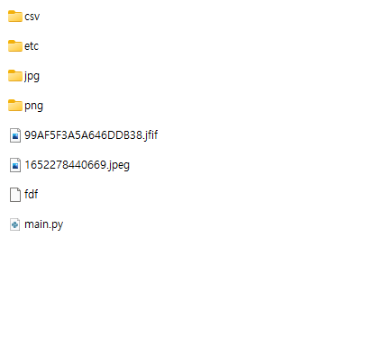
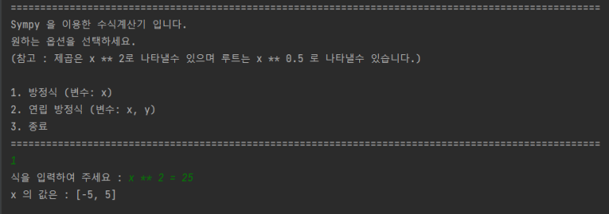
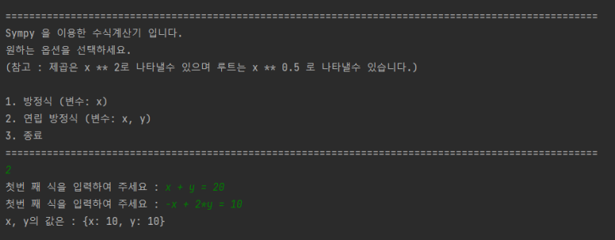
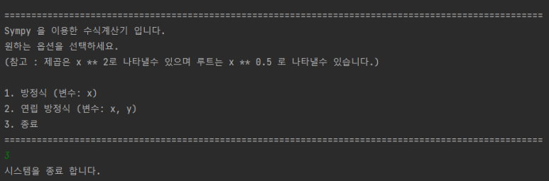

## 프로젝트 PythonLibrary 소개 

 

해당 리포지토리는 Python 공부를 하면서 외부 라이브러리 혹은 표준 라이브러리를 하나씩 찾아보며 라이브러리를 어떻에 활용 할 수 있을까? 고민하고 해당 라이브러리를 활용하여 기능을 구현해보는 프로젝트을 저장하는 리포지토리 입니다. 

  

### 🎆 해당 프로젝트에서 사용한 기술과 개발과정

 

🟧  사용한 기술 :  Python  
🟧  개발 기간 : 22년 6월 24일 ~ ING    

Python 표준,외부 라이브러리에서 많이 사용하는 것들을 검색하고 찾아보면서 제가 만들어 사용할 수 있는 것들을 우선적으로 먼저 개발하고 구현하였습니다. 

  

⬛ Shutil 라이브러리를 이용한 파일 자동 분류기 

 

 

Shutil 라이브러리를 이용하여 한 폴더에 모든 파일을 집어 넣어두고 나중에 프로그램만 한번 딱 실행하면 알아서 분류될 수 있도록 개발하였습니다. 

 

⬛ sympy 을 통한 방정식 자동 풀이 프로그램 

 

 

sympy 라이브러리를 통해서 수식을 숫자만 입력하면 자동으로 계산해주는 프로그램을 개발하였습니다.

  

### ✌️ Readme.md 에 게시된 내용은 아래 블로그에서도 확인하실수 있습니다. 

 

▪️  블로그 : https://blog.naver.com/j3heawon
